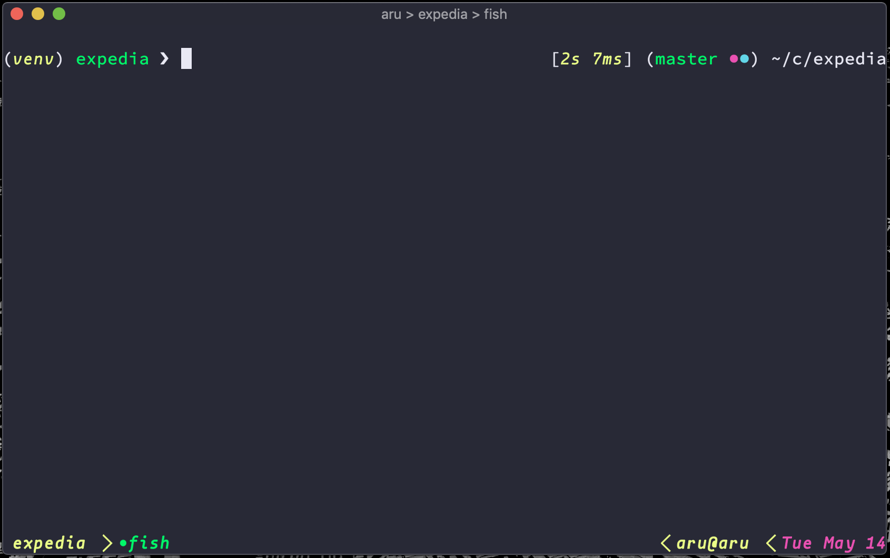

# Dotfiles #

A set of files that begin with a dot and are updated quite frequently.



## Dependencies ##

- osx as your operating system
- xcode developer tools
- [fish](http://fishshell.com/) as your command line shell
- [homebrew](https://brew.sh/) for package management
- [stow](https://gnu.org/software/stow) for symlink management

## Getting started ##

1. clone the repo in your `$HOME`:
	```
	git clone --recursive --jobs 8 git@github.com:arumoy-shome/dotfiles.git
	git submodule update --init --jobs 8
	```
1. execute the `bootstrap` script with `./bootstrap`, this will install the core dependencies
2. use `./deploy` to install, link/unlink/relink & delete topics
	```
    usage: ./deploy FLAGS TOPICS
    if no FLAGS are passed then given TOPICS are installed & linked

    valid FLAGS: -h -l -L -u -d -r
    -h: print this help message
    -L: list enabled topics
    -l: link given TOPICS
    -u: unlink given TOPICS
    -r: relink given TOPICS (unlink followed by link)
    -d: delete given TOPICS

    example usage:
    ./deploy base # install and link base
    ./deploy base zsh fish # install and link base, zsh & fish
    ./deploy -l base zsh fish # only link base, zsh & fish
    ./deploy -d tmux # delete tmux
	```
Make sure to read the corresponding topic/README before installing for caveats and dependencies.

## Organisation ##

1. Each topic is under it's own directory
2. A topic must contain a `_init` script
3. `_init` must define an `install` function for the topic to be valid
4. Executables can be placed under topic/bin which will be automatically loaded into the `PATH`
5. Additional shell configs can be placed under topic/conf.d/topic.fish, these are (sym)linked to `XDG_CONFIG_DIR/fish/conf.d` and are automatically picked up by fish
6. Set the `TARGET` variable in topic/\_init to the path where you want your config files to be symlinked (ie. `$HOME`, `$XDG_CONFIG_HOME` or otherwise)
6. Use `topic/_init#install` to define how to install a topic. Additionally, one off actions such as setting up `PATH` or exporting variables can be placed here
9. Use `topic/_init#delete` to undo `topic/_init#install`. In essence, `install` & `delete` must only contain one off actions that cannot be executed multiple times.
10. Finally, `test` is a topic for testing. Use this to test out scripts before running scripts on actual files!

## License ##

This project is open sourced and free to use under the [MIT license](LICENSE.md).

## Credits ##

* [Thoughtbot](https://github.com/thoughtbot/dotfiles)
* [Greg Hurrell](https://github.com/wincent/wincent)
* [Chris Toomey](https://github.com/christoomey/dotfiles)
* [Henrik Lissner](https://github.com/hlissner/dotfiles)
* [Harry Schwartz](https://github.com/hrs/dotfiles)
* [Luke Smith](https://github.com/LukeSmithxyz/mutt-wizard)
