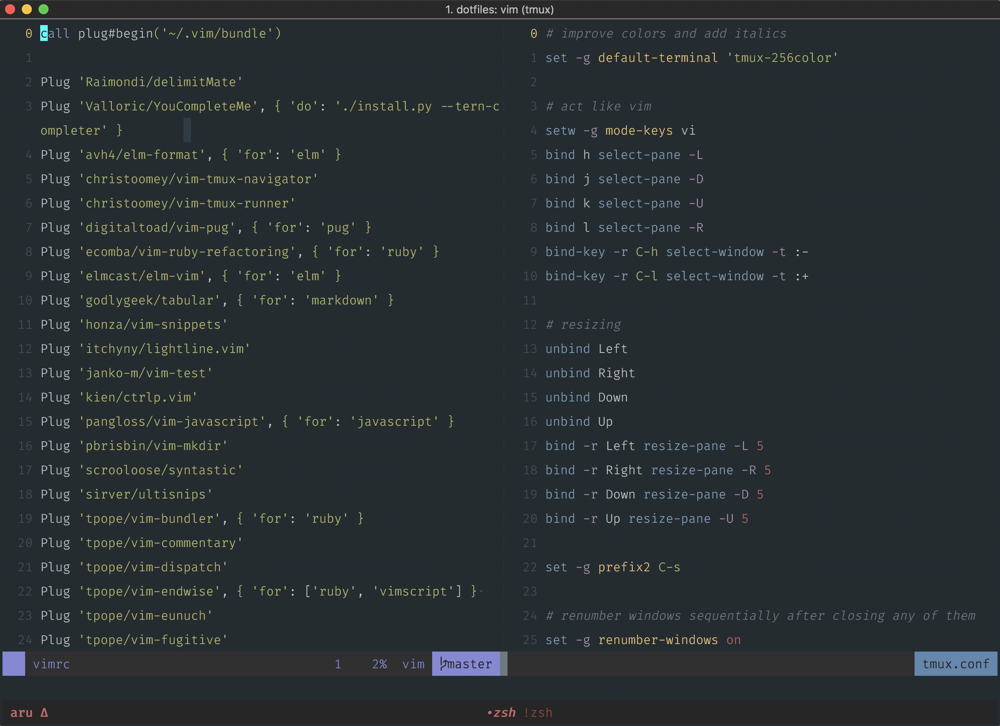

# Dotfiles #

A set of files that begin with a dot and are updated quite frequently.



I use [rcm](https://github.com/thoughtbot/rcm) behind the scenes to symlink the
files into my home directory.

## Dependencies ##

* A relatively new Vim version (ideally 7.5 and above) compiled with Python3
  support. For more info, check this [Github
  issue](https://github.com/Homebrew/legacy-homebrew/issues/20327)
* A relatively new Zsh version as your shell.
* A relatively new Tmux version (ideally 2.1 and above).
* iTerm as your terminal since the default terminal app does not play nice with
  italics.
* [Vim Plug](https://github.com/junegunn/vim-plug/) as your Vim plugin manager.
* [Zplug](https://github.com/zplug/zplug) as your Zsh plugin manager.
* [rcm](https://github.com/thoughtbot/rcm) to manage your dotfiles.
* [chruby](https://github.com/postmodern/chruby) to manage your rubies.
* [reattach-to-user-namespace](https://github.com/ChrisJohnsen/tmux-MacOSX-pasteboard)
  if using Tmux version below 2.6 (Tmux bakes this in starting at version 2.6).
* [terminal-notifier](https://github.com/julienXX/terminal-notifier) for
  notifications from processes.

## Getting started ##

Before you begin, I recommend that you install all the [dependencies](#dependencies),
links to instructions on how to install them are provided above.

1. Set Zsh as your default shell
```zsh
chsh -s $(which zsh)
```
2. Clone this repo into your home directory
```zsh
git clone git@github.com:arumoy-shome/dotfiles.git ~/dotfiles
```
3. Run rcm
The two main commands that rcm gives us are `lsrc` and `rcup`, you can read more
about what these commands do in the man pages. For the purposes of getting set
up, run the following command:
```zsh
env RCRC=$HOME/dotfiles/rcrc rcup
```
**Note**: You only need to add the `RCRC` environment variables for the very
first time, for all subsequent calls, you can simply run `rcup`.
4. Open a new terminal tab and you should now see all the dotfiles correctly
   symlinked in to your home directory.

## Organization ##

Only caveats here are how I organize my vim and zsh settings. All my vim
settings are split up into individual files under `vim/plugin`, filetype
specific settings are under `vim/ftplugin` and the remaining are under
`vim/autoload/aru`. If you don't understand this setup and wish to learn why
this works, check out vim's help docs on `runtimepath`. You can do so with the
following command in vim:

```vimscript
:h runtimepath
```

All my configs for zsh are split into individual files under `zsh/configs`. The
files names pretty much explain what each of them do so I won't go into too much
detail here.

The `bin` directory has some handy scripts (taken from [Thoughtbot
dotfiles](https://github.com/thoughtbot/dotfiles/tree/master/bin)). The `tat` is
my favourite!

## License ##

This project is open sourced and free to use under the [MIT license](LICENSE.md)].

## Credits ##

* [Thoughtbot](https://github.com/thoughtbot/dotfiles)
* [Greg Hurrell](https://github.com/wincent/wincent)
* [Chris Toomey](https://github.com/christoomey/dotfiles)
