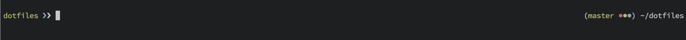
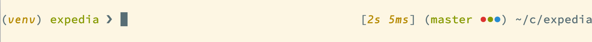

# fish

Install [fish](https://fishshell.com) and set it as the default shell.

## Highlights

1. A fast and clean prompt that includes:
  - [left](https://github.com/arumoy-shome/dotfiles/blob/master/fish/functions/fish_prompt.fish):
    virtualenv if active, basename of current dir, background job indicator
    (blue arrow) and prompt separator (white arrow) which turns red
    if the last exit status was not 0.
  - [right](https://github.com/arumoy-shome/dotfiles/blob/master/fish/functions/fish_right_prompt.fish):
    execution time of last command if it takes longer than 1 second, git branch
    and untracked, modified & staged files indicated by color and
    finally shortened pwd.
2. A [git
   wrapper](https://github.com/arumoy-shome/dotfiles/blob/master/fish/functions/g.fish)
   exposed as a single function `g` which envokes `git status` when called
   without any arguments (inspired by [Thoughtbot
   dotfiles](https://github.com/thoughtbot/dotfiles/blob/master/zsh/functions/g)).
3. A
   [activate](https://github.com/arumoy-shome/dotfiles/blob/master/fish/functions/activate.fish)
   which mirrors the `deactivate` function provided by Python's venv module.
3. Automatically `ls` after `cd`.
4. a [colors
   function](https://github.com/arumoy-shome/dotfiles/blob/master/fish/functions/colors.fish)
   to quickly switch between a light and dark theme.

## Dependencies

`colors` requires topic
[base16](https://github.com/arumoy-shome/dotfiles/tree/master/base16) to be enabled.
